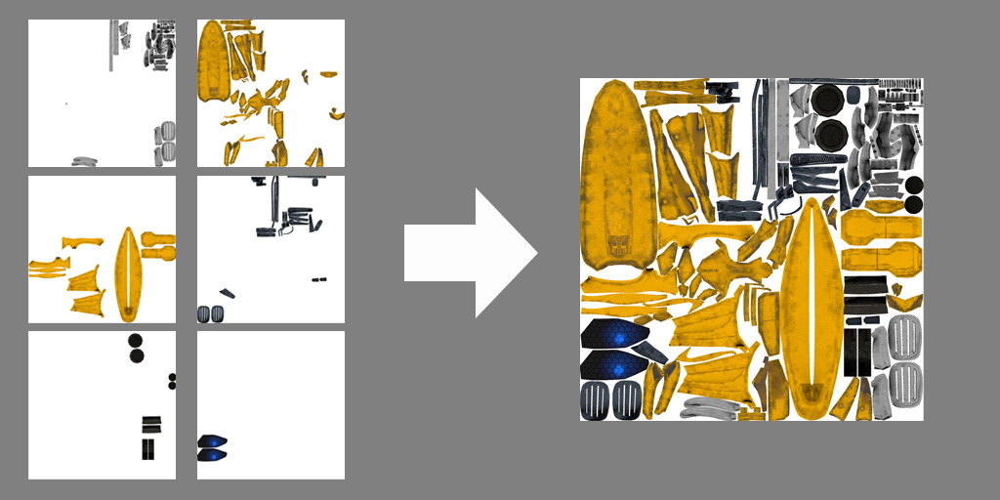
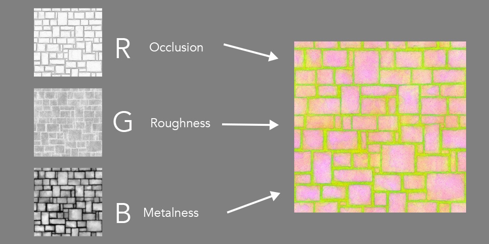

# pythonScripts

**combineTexture.py**

This script will combine the multiple textures into one texture.(Use all textures inside the directory)

The script takes 3 argments *folderpath*, *image resolution*, *texture type*.  
E.g. python3 combineTexture.py ./tex/ 1024 base.  
Texture types including "base", "normal", "metalic", "roughness", "ao", "emissive".  
Tesolution should be same as original texture resolution.  
Python and PIL library is required.  

**texturePacker.py**

This script will create one single ORM texture by using AO, Metalness and Roughness texture.  

The script takes 1 argment *folderpath*.  
E.g. python3 combineTexture.py ./tex/.  
Each texture should have "_o" or "_r" or "_m"(Stands for occlusion, roughness, and metalness) at the end of the file name.    
Python and PIL library is required.  
