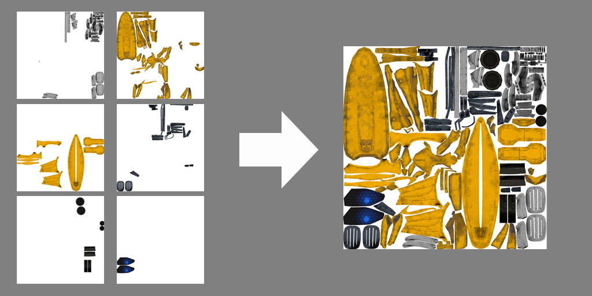

# pythonScripts

**combineTexture.py**

This script will combine the multiple textures into one texture.(Use all textures inside the directory)

The script takes 3 argments *folderpath*, *image resolution*, *texture type*.  
ex) python3 combineTexture.py ./tex/ 1024 base.  
Python and PIL environment required.  
texture types including "base", "normal", "metalic", "roughness", "ao", "emissive".  
resolution should be same as original texture resolution.  
